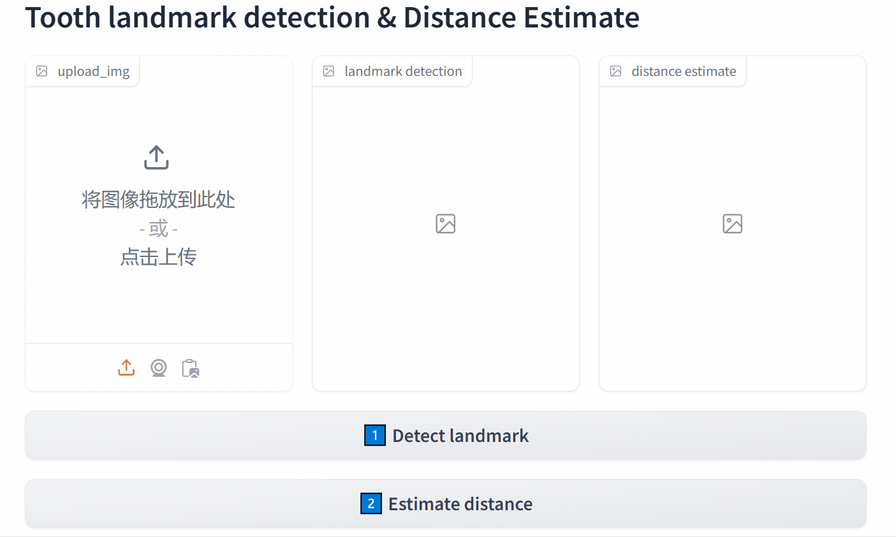
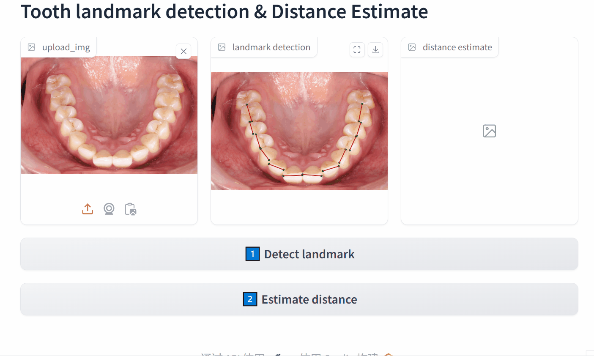

# TDE （Tooth Distance Estimation）


## 1. install 

```
conda create -n tde python=3.8
pip install -r requirement.txt
```

 Downloads [CBAM-HRNet weight](https://drive.google.com/file/d/1Rd3xevgJqsDL4Gs3WgihZrkgaxSJlVuB/view?usp=sharing) <br/>
 Downloads [TDE weight](https://drive.google.com/file/d/1ODmtd1NewZJtJvuueSjOYvP8qEBKzLoV/view?usp=sharing)


## 2. run gradio-demo
put CBAM-HRNet weight to ./CBAM-HRNet-Detection/pth_dir <br/>
put TDE weight to ./zoe-tooth-distance/tooth_check 

```
 python gradio_app.py
```


## 3. demo-pipline
<h3>3.1 first step<h3/>
 <br/>
<h3>3.2 second step<h3/>


